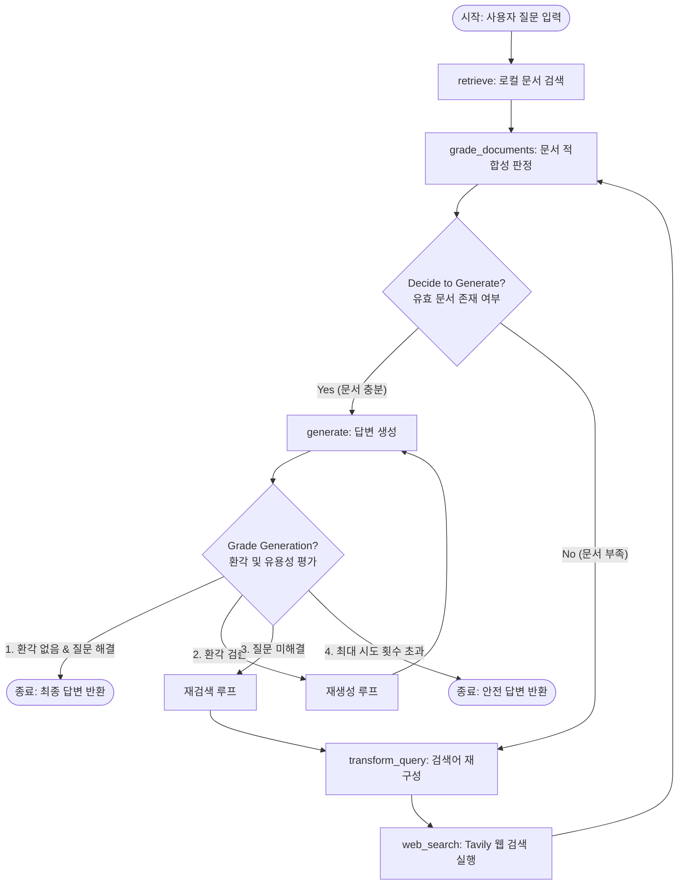

# 벡터 DB 시각화 기반의 적응형 RAG 에이전트 학습 프로젝트

본 프로젝트는 한양대학교 인공지능 에이전트 및 활용 기말 프로젝트의 일환으로 개발된, RAG(검색 증강 생성)의 핵심 동작 원리와 벡터 데이터베이스의 개념을 시각적으로 이해하기 위한 교육 및 학습용 RAG 시각화 프로젝트입니다.

기존 Naive RAG 시스템의 취약점(환각 현상, 정보 부족, 낮은 관련성)을 스스로 보완하는 자가 수정 및 적응형 RAG 에이전트(LangGraph)의 내부 워크플로우를 시각화하고, 고차원의 임베딩 벡터가 의미론적 유사도에 따라 2차원 공간에 어떻게 매핑되는지 직접 관찰 및 실습할 수 있도록 설계되었습니다.

---

## 프로젝트 정보
*   과목명: 클라우드AI프로그래밍
*   소속 대학: 한양대학교 (Hanyang University)
*   개발자: 조인준 (학번: 2020039507, 1인 개발)
*   배포 URL: 
    *   실시간 서비스 웹 UI: [https://injun-cloud.duckdns.org/rag/](https://injun-cloud.duckdns.org/rag/)
    *   실시간 서비스 API 문서: [https://injun-cloud.duckdns.org/rag/docs](https://injun-cloud.duckdns.org/rag/docs)

---

## 주요 목표 및 핵심 기능

1.  동적 에이전트 제어 흐름 구현 (LangGraph):
    *   단순한 단방향 파이프라인 RAG가 아닌, 평가에 따라 뒤로 돌거나 웹 검색으로 분기하는 순환형 상태 전이 그래프(Stateful Cyclic Graph) 아키텍처의 동작 과정을 구현합니다.
2.  임베딩 및 의미론적 거리 시각화 학습 (SVD 차원 축소):
    *   입력 문서와 질문이 `models/gemini-embedding-001`을 거쳐 768차원 고차원 벡터로 변환되고, 이를 SVD(특이값 분해)를 통해 2차원 좌표 `(x, y)`로 압축 투영하여 Chart.js 산점도로 시각화합니다.
    *   질문 벡터와 연관 문서 벡터가 서로 가까이 배치되는 기하학적 분포 변화를 실시간으로 비교 체험합니다.
3.  자가 수정 RAG 메커니즘 (Self-Corrective RAG) 실습:
    *   LLM 평가기(`doc_grader_chain`)를 통해 수집된 지식 중 쓸모없는 문서를 스스로 걸러내고, 최종 답변 생성 후 환각 검사(Hallucination Check) 및 유용성 검사(Utility Check)를 거쳐 자가 수정을 수행하는 다단계 품질 보증 프로세스를 학습합니다.
4.  적응형 RAG (Adaptive RAG) 실습:
    *   로컬 지식베이스에 적합한 정보가 없을 경우, 에이전트가 질문을 직접 재구성(`transform_query`)하여 실시간 웹 검색(Tavily API)을 통해 동적으로 정보를 확장 수집하는 과정을 탐구합니다.
5.  대화형 인터랙티브 학습 대시보드 (RAG Studio):
    *   사용자가 학습용 문서를 자유롭게 추가(`add-document`)하거나 삭제하고 질의를 던져보며, 에이전트의 실시간 생각 흐름 로그와 프롬프트 조립 방식, 그래프 노드별 위저드(Wizard) 진행률을 한눈에 추적합니다.

---

## 에이전트 제어 워크플로우



---

## 기술 스택 (Tech Stack)

*   LLM & Embedding: Google Gemini 2.5 Flash (`gemini-2.5-flash`), `models/gemini-embedding-004`
*   Orchestration: LangGraph, LangChain Core
*   Search API: Tavily Search API
*   Backend: FastAPI, Uvicorn, NumPy
*   Frontend: Vanilla HTML5, CSS3, Javascript (Chart.js, FontAwesome)
*   Deployment: Docker, Docker Compose, Nginx, Paramiko(SSH 자동 배포)

---

## 파일 구조 (Directory Structure)

*   `app.py`: FastAPI 웹 서버 엔트리포인트 및 API 라우터, 대시보드 HTML 반환
*   `main.py`: LangGraph 워크플로우 빌드, 조건부 라우팅 정의 및 로컬 CLI 테스터
*   `agent/`: 에이전트 핵심 로직 패키지
    *   `state.py`: 노드 간 상태 전이를 공유하는 `AgentState` 정의
    *   `vector_db.py`: `GoogleGenerativeAIEmbeddings`와 NumPy(SVD)를 이용한 인메모리 벡터 DB 및 2D 시각화 투영 엔진 구현
    *   `nodes.py`: 에이전트 그래프의 각 단계별 노드 함수 (Retrieve, Grade Documents, Transform Query, Web Search, Generate) 구현체
    *   `chains.py`: `with_structured_output` 및 Pydantic을 이용한 평가 체인 및 생성 체인 정의
*   `templates/index.html`: Chart.js 산점도 시각화, 진행 위저드 바, 생각 흐름 로그, 문서 수집 제어기가 포함된 RAG Studio HTML/JS 소스
*   `Dockerfile` / `docker-compose.yml`: Docker 가상화 컨테이너 구성 파일

---

## API 명세서 (API Endpoints)

FastAPI는 Swagger UI를 기본적으로 제공하며, 주요 엔드포인트는 다음과 같습니다.

| 메서드 | 엔드포인트 | 요약 | 설명 |
| :--- | :--- | :--- | :--- |
| GET | `/` | 웹 대시보드 반환 | RAG Studio Web UI 파일(`index.html`)을 브라우저에 렌더링 |
| GET | `/health` | 서버 헬스 체크 | API 서버의 현재 작동 상태 점검 |
| POST | `/add-document` | 문서 임베딩 및 DB 추가 | 새로운 문서를 입력받아 임베딩을 생성하고 인메모리 벡터 DB에 축적 |
| POST | `/clear-documents` | 벡터 DB 전체 초기화 | 인메모리 벡터 DB 내의 모든 문서 데이터를 초기화 |
| GET | `/documents` | 문서 2D 좌표 조회 | 현재 벡터 DB에 보관된 모든 문서들의 2차원 투영 좌표 반환 |
| POST | `/query-visualize` | 2D 시각화 지원 에이전트 질의 | 질문 벡터와 문서 벡터를 비교하고 2D PCA 연산 결과를 포함하여 LangGraph 에이전트 연쇄 실행 및 시각화 데이터 반환 |
| POST | `/query` | 에이전트 질의 (기본 호환) | 단순 Q&A용으로, 2D 시각화 없이 에이전트의 응답 결과만 반환 (CLI/구버전 호환) |

---

## 시작 가이드 (Quick Start)

### 1. 환경 변수 설정
프로젝트 루트 디렉토리에 `.env` 파일을 생성하고 필요한 API 키를 입력합니다.
```env
GEMINI_API_KEY=your_gemini_api_key_here
GOOGLE_API_KEY=your_gemini_api_key_here
TAVILY_API_KEY=your_tavily_api_key_here
```

### 2. Docker Compose로 실행 (권장)
컨테이너 가상화 기술을 사용해 서버를 간편하게 실행할 수 있습니다.
```bash
# 컨테이너 빌드 및 백그라운드 구동
docker compose up -d --build
```
*   로컬 웹 UI 접속: `http://localhost:8000/`
*   로컬 API 문서 (Swagger): `http://localhost:8000/docs`

### 3. 로컬 가상환경에서 직접 실행
Docker 없이 로컬 파이썬 가상환경에서 작동시키는 방식입니다.
```bash
# 가상환경 생성 및 활성화
python3 -m venv .venv
source .venv/bin/activate

# 필수 패키지 설치
pip install -r requirements.txt

# FastAPI 서버 구동
python app.py
```

---

## 시각화 핵심 알고리즘 (PCA / SVD)

고차원 공간(3072차원)에 임베딩된 문서와 질문 벡터 간 관계를 인간이 시각적으로 파악할 수 있도록, `agent/vector_db.py`의 `MemoryVectorDB`는 SVD(특이값 분해) 알고리즘을 사용한 차원 축소를 실시간으로 수행합니다.

```python
# 1. 문서 벡터와 질문 벡터를 병합하여 행렬 X를 구성합니다.
# 2. 평균을 빼서 데이터를 센터링합니다.
mean = np.mean(X, axis=0)
X_centered = X - mean

# 3. SVD를 활용해 상위 2개의 주성분(Principal Components)으로 정사영합니다.
U, S, Vt = np.linalg.svd(X_centered, full_matrices=False)
X_2d = np.dot(X_centered, Vt[:2].T)

# 4. 화면 크기에 맞게 격자 좌표(-8 ~ 8) 영역으로 스케일링을 실시합니다.
```
이로써 사용자가 직접 업로드한 학습용 문서(Context)들과 입력 질문 간의 유사적 관계가 Chart.js 화면 상의 기하학적 거리로 실시간 매핑되어 시각적 학습 교구로서 기능할 수 있습니다.
